# 三维装箱我来帮忙-帮助文档

## 1. 创建项目

### 1.1 创建一个新项目，项目内没有任何货物信息

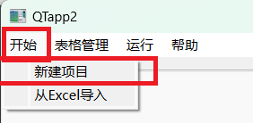

接着选择货物要发往的地区。


点击确定后就在新的标签页面中创建了一个空白的新项目，其中的货物都发往选择的地区。其中标签名中带有该地区。

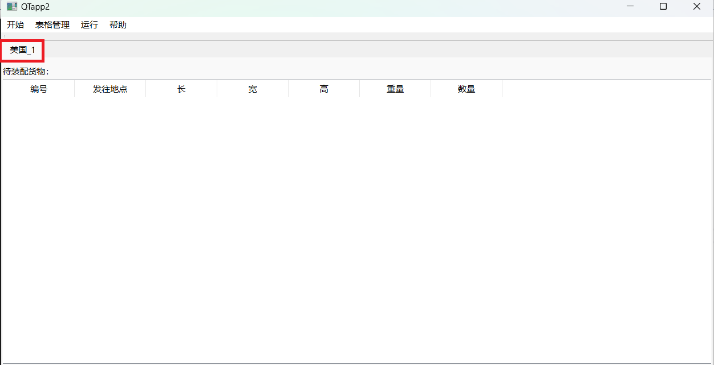

### 1.2 从Excel创建一个新项目，读入Excel文件中的货物信息

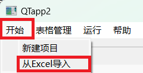

点击```从Excel导入```按钮后，选择标准化的Excel文件，满足：

1. Excel表中的Sheet名是```['au','us','uk','de','jp']```中的其中一个，表示该Sheet中的货物信息是发往澳洲、美国、英国、德国和日本中的其中一个地方。
2. 每个Sheet的第一行是列名，每列按顺序是:

| 编号 | 发往地点 | 长(cm) | 宽(cm) | 高(cm) | 重量(kg) | 数量 |
| :--: | :------: | :----: | :----: | :----: | :------: | :--: |

​	之后是每个货物的信息。

```./docs/```目录下有```example.xlsx```文件以供格式参考。

## 2. 项目管理

### 2.1 添加空白货物信息

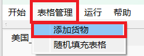

点击```添加货物```按钮后，在弹出的对话框中填入要添加货物信息的条数$n$，就可以添加$n$条空白的货物信息，并发送往默认的地区。

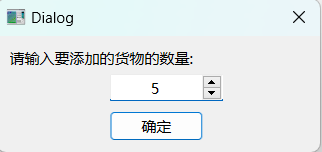

### 2.2 删除货物信息

右键要删除货物信息的**行标签**。(图中蓝色区域为货物3的行标签)

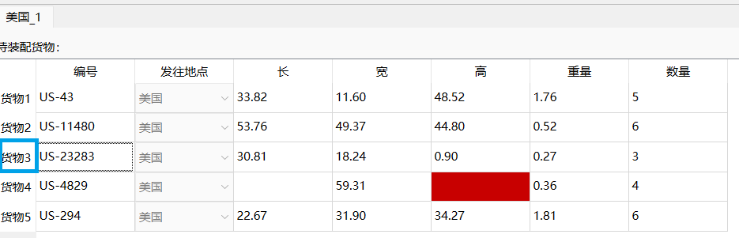

随后在弹出的菜单中点击```删除行```按钮即可。

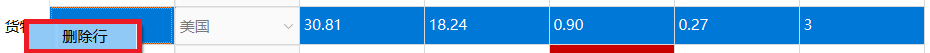


### 2.3 输入货物信息

双击单元格直接输入即可，但是要满足输入规范:

|                       编号                       | 发往地点 |   长(cm)   |   宽(cm)   |   高(cm)   |  重量(kg)  |  数量  |
| :----------------------------------------------: | :------: | :--------: | :--------: | :--------: | :--------: | :----: |
| 以['AU','US','UK','DE','JP']开头，和发往地点对应 | 自动填写 | 非负浮点数 | 非负浮点数 | 非负浮点数 | 非负浮点数 | 正整数 |

输入不合法会提示错误信息，并且错误单元格会变成红色。

### 2.4 随机生成数据

点击```随机生成数据```会把**所有**单元格都随机生成一个数据，<font color="red">包括已经填写的单元格</font>，使用时要谨慎！

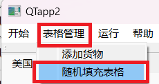

## 3. 算法执行和结果展示

### 3.1 执行算法

<font color="red">当前所在标签页中的数据都填写完毕以后</font>，点击```FF算法```按钮就可以执行货物装配算法。

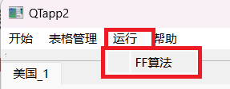

本软件采用**简单贪心策略**，先对所有货物按体积从大到小排序，接着逐个放置物品$i$。

放置物品$i$的策略是，遍历每一个已经有的箱子$j$，尝试一共<font color="red">$6$</font>种防止方式，找到使得当前箱子$j$空间利用率最大的方式$F$，则直接把货物$i$以$F$放入箱子$j$中。

如果找不到任意一个已经有的箱子能够放下$i$，则加入一个新的箱子并将$i$放入其中。

### 3.2 指标解释

算法运行的结果以表格方式给出:

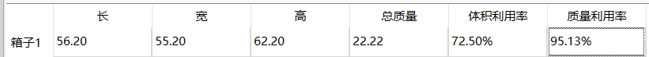

其中每一行代表需要的一个箱子，而每一列代表的含义如下:

|   长(cm)   |   宽(cm)   |   高(cm)   |  总质量(kg)  |       体积利用率(%)        |         质量利用率(%)          |
| :--------: | :--------: | :--------: | :----------: | :------------------------: | :----------------------------: |
| 箱子的长度 | 箱子的宽度 | 箱子的高度 | 箱子的总质量 | 货物总体积占箱子体积的比例 | 货物总质量占整个箱子质量的比例 |

### 3.3 可视化

**右键**每一个箱子的**行标签**区域，表示选中该箱子。

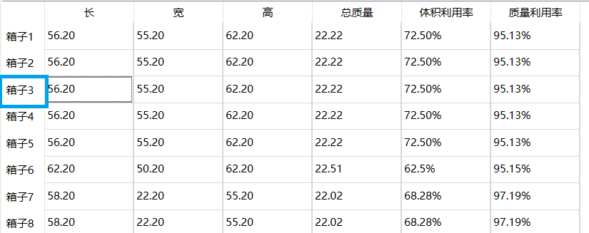

并且在弹出的菜单中选择```显示三维方案```则可以查看该箱子具体的装配三维视图。


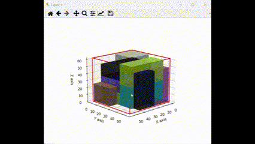

### 3.4 装箱结果导出

该标签页的算法执行结果会以标准化的形式被保存在```./docs/```目录下，具体文件名请查看弹出的提示框，所谓格式化的数据的格式是：

第一行给出一个$n$，表示箱子的个数。

接下来$n$组，每一组表示一个箱子的具体描述。

箱子$i$(第$i$组)第一行给出$length_i,width_i,height_i$，表示该箱子的三维形状，

接下来一行给出$weight_i$表示该箱子的总质量。

接下来一个数字$m$表示该箱子内所装的货物的数量。

接下来$m$行给出箱子$i$​内所装的货物的具体描述：

每一行依次给出$No_{ij}$，$x_{ij},y_{ij},z_{ij}$，$length_{ij},width_{ij},height_{ij}$，以空格分割，分别表示每一个箱子的编号、在**箱子坐标系中**的**货物坐标系原点**的$x$坐标、$y$坐标、$z$坐标，和货物本身的长、宽和高。


